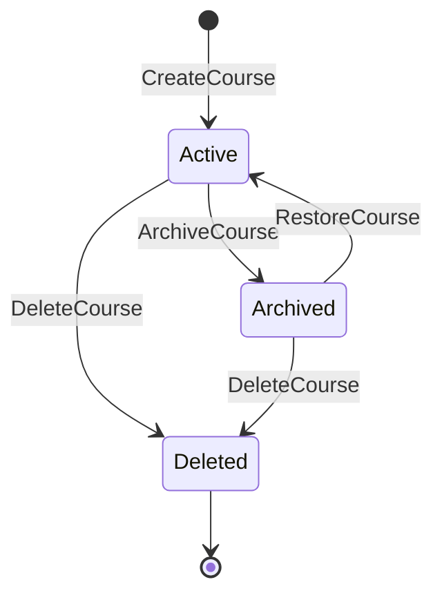
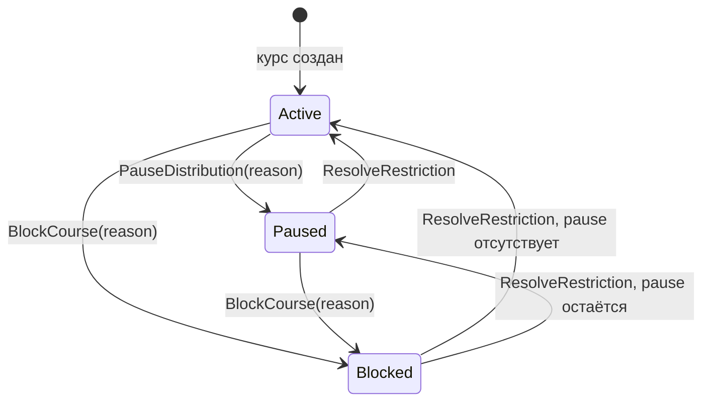
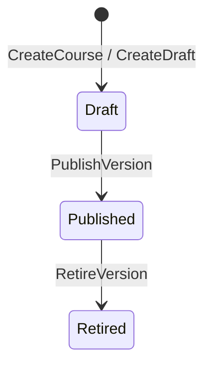
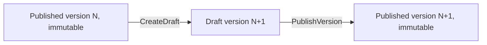
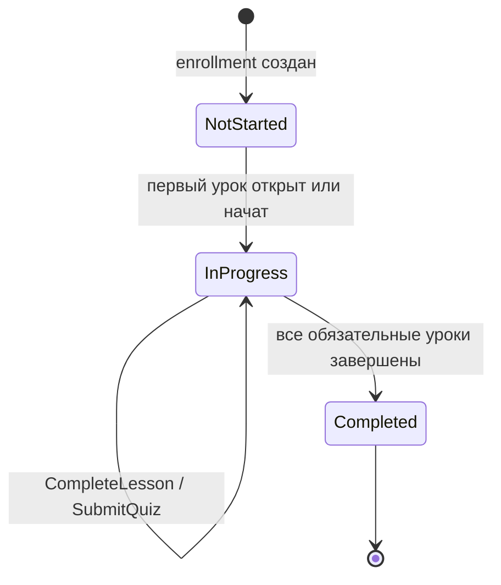
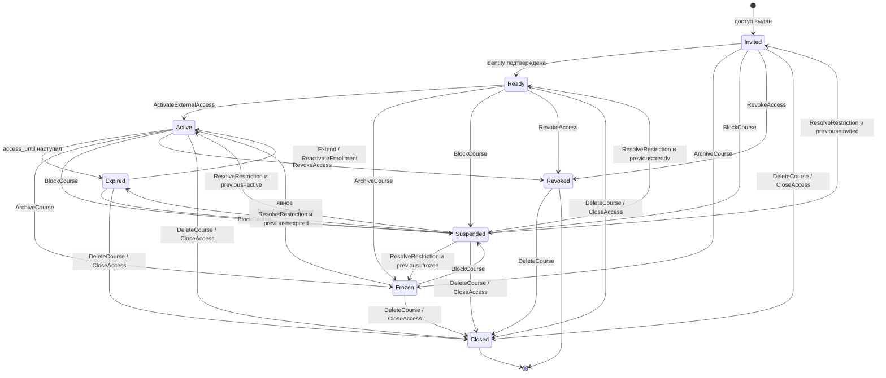
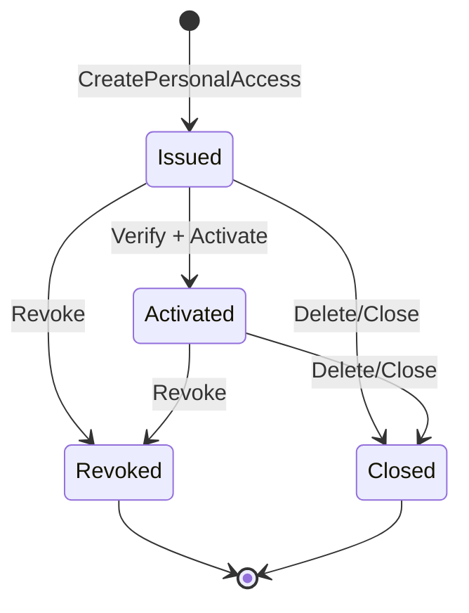
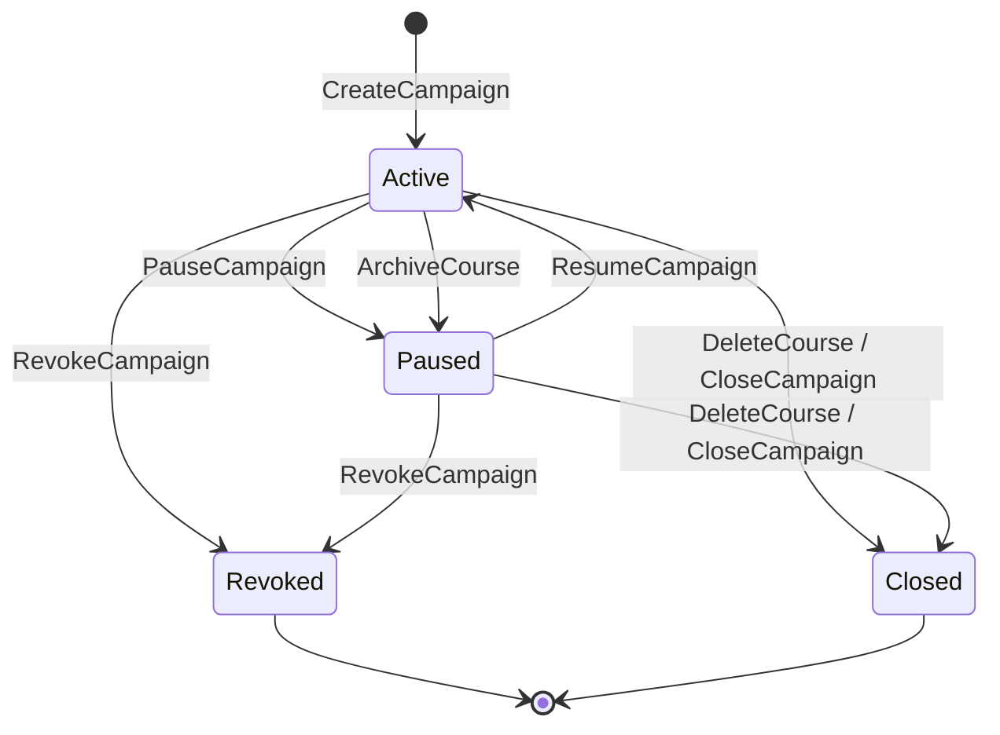

# Академия: диаграммы состояний

Документ фиксирует допустимые переходы целевой модели Академии. Проверки переходов выполняет backend внутри доменной команды и транзакции. Клиент не может установить состояние прямой записью поля.

## 1. Курс: жизненный цикл



| Состояние | Новые выдачи | Незавершённое внешнее обучение | Пользовательский content | Возврат |
|---|---:|---|---|---:|
| `active` | да, если distribution active | продолжается | по правилам enrollment | — |
| `archived` | нет | переводится в `frozen` | только завершённые уроки и результаты | явный `RestoreCourse` |
| `deleted` | нет | переводится в `closed` | не возвращается | запрещён |

Restore не размораживает enrollment и не возобновляет campaign. После restore actor отдельно выбирает: продолжить прежнюю версию с новым deadline, создать повторное прохождение последней версии или оставить старое прохождение frozen.

## 2. Курс: состояние распространения



- `paused`: новые links, campaigns и activation запрещены; уже активные ученики продолжают.
- `blocked`: links, campaigns, enrollment и content недоступны; progress сохраняется, access становится `suspended`.
- При unblock предыдущий access status восстанавливается, а `access_until` сдвигается на длительность block.
- Причина, actor и дата pause/block обязательны.
- Block нельзя обойти публикацией новой версии.

Жизненный цикл и распространение — независимые оси. Эффективное состояние:

```text
deleted > blocked > archived > paused > active
```

## 3. Версия курса



Создание следующего draft не является обратным переходом published version: это создание нового агрегата версии.



- У курса не более одного draft.
- Published и retired версии неизменяемы.
- Публикация присваивает следующий номер и обновляет pointer курса транзакционно.
- Enrollment, assignment, access, campaign, origin и отчёт сохраняют точный `course_version_id`.
- Новая публикация не переводит существующее прохождение.
- Retired означает запрет новых выдач этой версии, но не удаляет content и не прерывает pinned enrollment.

## 4. Enrollment: progress



Progress не откатывается и не переносится в другой enrollment или version. Repeat training создаёт новый enrollment с новым `attempt_number`.

## 5. Enrollment: доступ



`progress_status` и `access_status` ортогональны: completed enrollment может стать expired, frozen, suspended или closed, но исторический результат остаётся. Expired/frozen learner видит только завершённые уроки и свои результаты; future content не возвращается. Internal enrollment не использует hard deadline.

## 6. Персональный внешний доступ



- Только партнёр создаёт доступ для собственного published course; email обязателен.
- Повторное открытие использует тот же enrollment.
- Rotation меняет token, но не срок, version или progress.
- Extension продлевает тот же enrollment.
- Repeat создаёт новый enrollment, не очищая старый.
- Archive неактивированного доступа запрещает activation. Незавершённый enrollment отражается как frozen; для продолжения или нового прохождения после restore нужна отдельная явная команда.

## 7. Кампания



- `partner_promo` создаёт партнёр только для собственного курса.
- `company_candidate` создаёт owner/admin только для курса компании.
- На пару `(campaign_id, external_learner_id)` существует один enrollment; повторная активация идемпотентна.
- Другая кампания того же курса создаёт отдельное прохождение.
- Resume запрещён, если курс archived, deleted или blocked.
- Archive переводит активную кампанию в `paused`, поэтому restore не запускает её без явного resume. Block является более приоритетным временным gate: во время block кампания недоступна независимо от собственного status, после unblock снова действует сохранённый status.

## 8. Внешняя активация

```mermaid
flowchart LR
    A["Открытие token link"] --> B["Landing и outline без content"]
    B --> C["Имя и email"]
    C --> D["Email verification"]
    D --> E["Welcome и предупреждение о сроке"]
    E --> F["Активировать и начать"]
    F --> G["Идемпотентное создание или reuse enrollment"]
    G --> H["activated_at = server UTC now"]
    H --> I["access_until = activated_at + N × 24h"]
    I --> J["Открыт первый урок"]
```



До шага `F` deadline не идёт. Проверка истечения выполняется синхронно на каждом чтении и изменении; worker не является единственной защитой.
